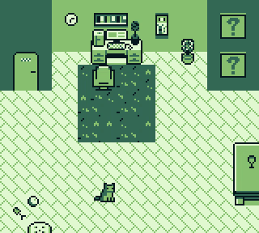
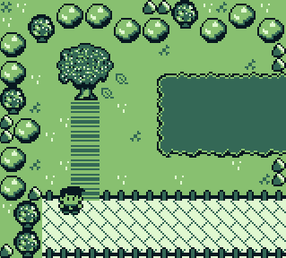

# Retro Soccer

A Game Boy game based on classic soccer manager games like Elifoot II for ZX Spectrum.
It uses [gbdk 2020](https://github.com/gbdk-2020/gbdk-2020) distribution for Linux builds.

> WARNING! This is a long term, experimental project for self learn

# Setup

First, make sure to edit the gbdk path inside make file:

```
GBDK_HOME = your-location-here
```

After this, running the `make` with all requirements to run gbdk should do
the job, it creates the ROM file (RetroSoccer.gb) inside `obj` folder that can be tested using any emulator (I like [SameBoy](https://sameboy.github.io/) it has versions for both Windows, Mac and Linux with cool features for debugging).

```
make
```

# Prints

|  |  |
| ----------------------------- | --------------------------------------- |
